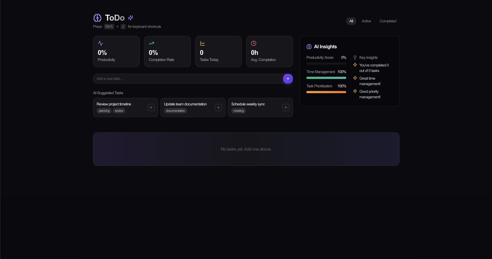

# Todo App

A comprehensive Todo application built with **Next.js**, **Prisma**, and **MongoDB**, providing a robust solution for task management with features like task creation, prioritization, and analysis.




## Features

- **Task Management**: Create, update, and delete tasks.
- **Prioritization**: Assign low, medium, or high priority levels to tasks.
- **Tagging**: Add tags to tasks for easy organization.
- **Completion Tracking**: Mark tasks as complete and log completion times.
- **Analysis**: Gain insights into productivity, time management, and prioritization scores.
- **API Routes**: RESTful API routes for CRUD operations.

## Tech Stack

- **Next.js**: For building a fast, scalable, and SEO-friendly front-end.
- **Prisma**: As the ORM to interact with the MongoDB database.
- **MongoDB**: A NoSQL database for storing task data.
- **React Hooks**: To manage state and lifecycle events in the app.

## Installation

### Prerequisites
- Node.js (>=14.x)
- pnpm or yarn
- MongoDB instance (local or cloud-based, e.g., MongoDB Atlas)

### Steps

1. Clone the repository:
   ```bash
   git clone https://github.com/your-username/todo-app.git
   cd todo-app
   ```

2. Install dependencies:
   ```bash
   pnpm install
   # or
   yarn install
   ```

3. Set up environment variables:
   Create a `.env` file in the root directory and include the following:
   ```env
   DATABASE_URL=mongodb+srv://<username>:<password>@<cluster-url>/todo-app?retryWrites=true&w=majority
   ```

4. Initialize the database:
   ```bash
   npx prisma db push
   ```

5. Start the development server:
   ```bash
   pnpm run dev
   # or
   yarn dev
   ```

6. Open the app in your browser:
   ```
   http://localhost:3000
   ```

## API Routes

### Create a Todo
- **Endpoint**: `POST /api/todos`
- **Payload**:
  ```json
  {
    "title": "Task Title",
    "priority": "low",
    "tags": ["work", "urgent"]
  }
  ```

<!-- ### Get All Todos
- **Endpoint**: `GET /api/todos`

### Update a Todo
- **Endpoint**: `PUT /api/todos/:id`
- **Payload**:
  ```json
  {
    "title": "Updated Task Title",
    "completed": true
  }
  ``` -->

### Delete a Todo
- **Endpoint**: `DELETE /api/todos/:id`

## Folder Structure

```
├── src
│   ├── app
│   │   ├── api
│   │   │   └── todos
│   │   │       ├── [id]
│   │   │       │   └── route.ts
│   │   │       │
│   │   │       └── route.ts
│   ├── components
│   ├── pages
│   ├── utils
│   │   └── prisma.ts
├── prisma
│   └── schema.prisma
├── .env
├── package.json
├── README.md
```

## Future Enhancements

- Add authentication for secure task management.
- Enable sharing and collaboration on tasks.
- Provide detailed productivity reports.
- Add calendar and deadline integration.

## License

This project is licensed under the MIT License.

---

Developed with ❤️ using Next.js, Prisma, and MongoDB.

